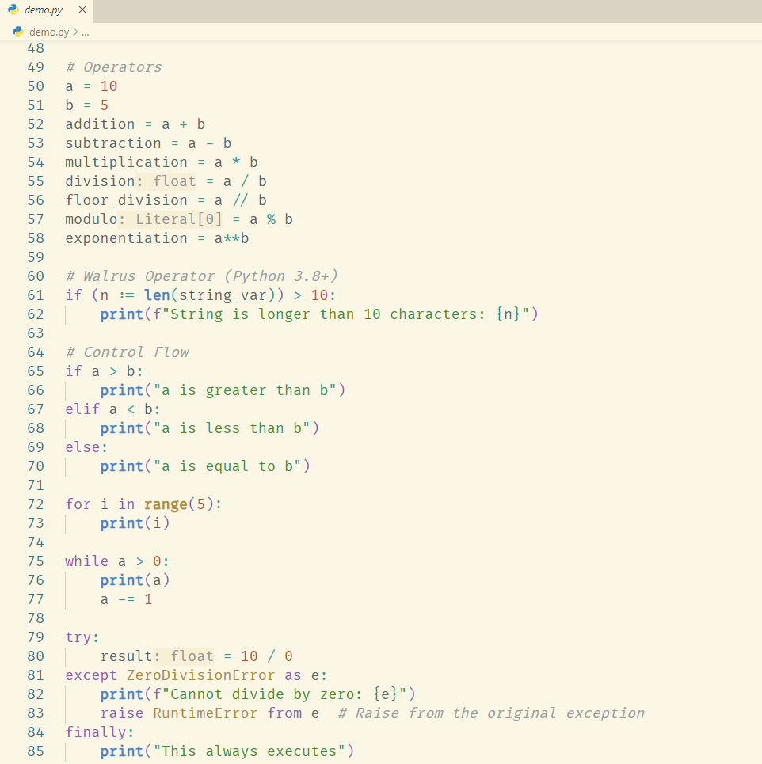

# VSCode Mixed Light Theme

A mixed Light theme for Visual Studio Code.

- Code in `demos/` is used to debug the theme color scheme, generated by LLM.

## Screenshot

## Thanks

- [Solarized](https://github.com/altercation/solarized)
- [Better Solarized](https://github.com/edheltzel/vscode-better-solarized)
- [One Dark Pro](https://github.com/Binaryify/OneDark-Pro)
- [Atom One Light Theme](https://github.com/akamud/vscode-theme-onelight)
